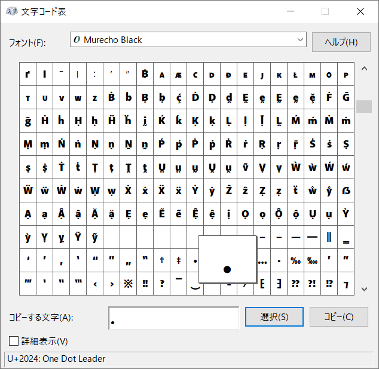

# 解法
ソースが配られており、それがリモートで動いている。
主要な処理は以下のようであった。
```python
~~~
flag = os.getenv("CTF4B_FLAG")

fqdn = "www.example.com"

# TEXT to PNG
def text2png(text:str) -> str:
    os.makedirs("phish", exist_ok=True)
    filename = "".join([random.choice(string.ascii_letters) for i in range(15)])
    png = f"phish/{filename}.png"
    img = np.full((100, 600, 3), 0, dtype=np.uint8)
    font = ImageFont.truetype("font/Murecho-Black.ttf", 64)
    img_pil = Image.fromarray(img)
    ImageDraw.Draw(img_pil).text((10, 0), text[:15], font=font, fill=(255, 255, 255)) # text[:15] :)
    img = np.array(img_pil)
    cv.imwrite(png, img)
    return png

# PNG to TEXT (OCR-English)
def ocr(image:str) -> str:
    tool = pyocr.get_available_tools()[0]
    text = tool.image_to_string(Image.open(image), lang="eng")
    os.remove(image)
    if not text:
        text = "???????????????"
    return text

# Can you deceive the OCR?
# Give me "www.example.com" without using "www.example.com" !!!
def phishing() -> None:
    input_fqdn = input("FQDN: ")[:15]
    ocr_fqdn = ocr(text2png(input_fqdn))
    if ocr_fqdn == fqdn: # [OCR] OK !!!
        for c in input_fqdn:
            if c in fqdn:
                global flag
                flag = f"\"{c}\" is included in \"www.example.com\" ;("
                break
        print(flag)
    else: # [OCR] NG
        print(f"\"{ocr_fqdn}\" is not \"www.example.com\" !!!!")
~~~
```
入力をtext2pngで画像にし、OCRで再度textにしたのちに`www.example.com`と一致すればflagが得られるようだ。  
しかし、`www.example.com`に含まれている文字を使用できない。  
以下のように一致しなかった場合に読み取り結果が得られるようだ。  
```bash
$ nc phisher.quals.beginners.seccon.jp 44322
       _     _     _                  ____    __
 _ __ | |__ (_)___| |__   ___ _ __   / /\ \  / /
| '_ \| '_ \| / __| '_ \ / _ \ '__| / /  \ \/ /
| |_) | | | | \__ \ | | |  __/ |    \ \  / /\ \
| .__/|_| |_|_|___/_| |_|\___|_|     \_\/_/  \_\
|_|

FQDN: www.example.coA
"www.example.coA" is not "www.example.com" !!!!
```
OCRに向けてホモグラフ攻撃を行えばよいとわかる。  
先頭から順に似ている文字を試せばよい。  
注意点として、フォントに含まれていない文字は利用できない。  
```bash
$ nc phisher.quals.beginners.seccon.jp 44322
~~~
FQDN: ωωω.example.coA
"www.example.coA" is not "www.example.com" !!!!
$ nc phisher.quals.beginners.seccon.jp 44322
~~~
FQDN: ωωω.ė×аⅿρIε.coA
"www.example.coA" is not "www.example.com" !!!!
$ nc phisher.quals.beginners.seccon.jp 44322
~~~
FQDN: Aww.ė×аⅿρIε.εοⅿ
"Aww.example.com" is not "www.example.com" !!!!
```
`ωωω.ė×аⅿρIε.εοⅿ`まで到達できたが、`.`が含まれている。  
`,`や`。`で代用しようと考えるが難しい。  
ここで、フォントがわかっていることを利用してcharacter mapsを見てやる。  
  
`U+2024`が利用できそうだ。  
これまでのすべての結果を合わせると`ωωω․ė×аⅿρIε․εοⅿ`となる。  
```bash
$ nc phisher.quals.beginners.seccon.jp 44322
       _     _     _                  ____    __
 _ __ | |__ (_)___| |__   ___ _ __   / /\ \  / /
| '_ \| '_ \| / __| '_ \ / _ \ '__| / /  \ \/ /
| |_) | | | | \__ \ | | |  __/ |    \ \  / /\ \
| .__/|_| |_|_|___/_| |_|\___|_|     \_\/_/  \_\
|_|

FQDN: ωωω․ė×аⅿρIε․εοⅿ
ctf4b{n16h7_ph15h1n6_15_600d}
```
flagが得られた。  

## ctf4b{n16h7_ph15h1n6_15_600d}